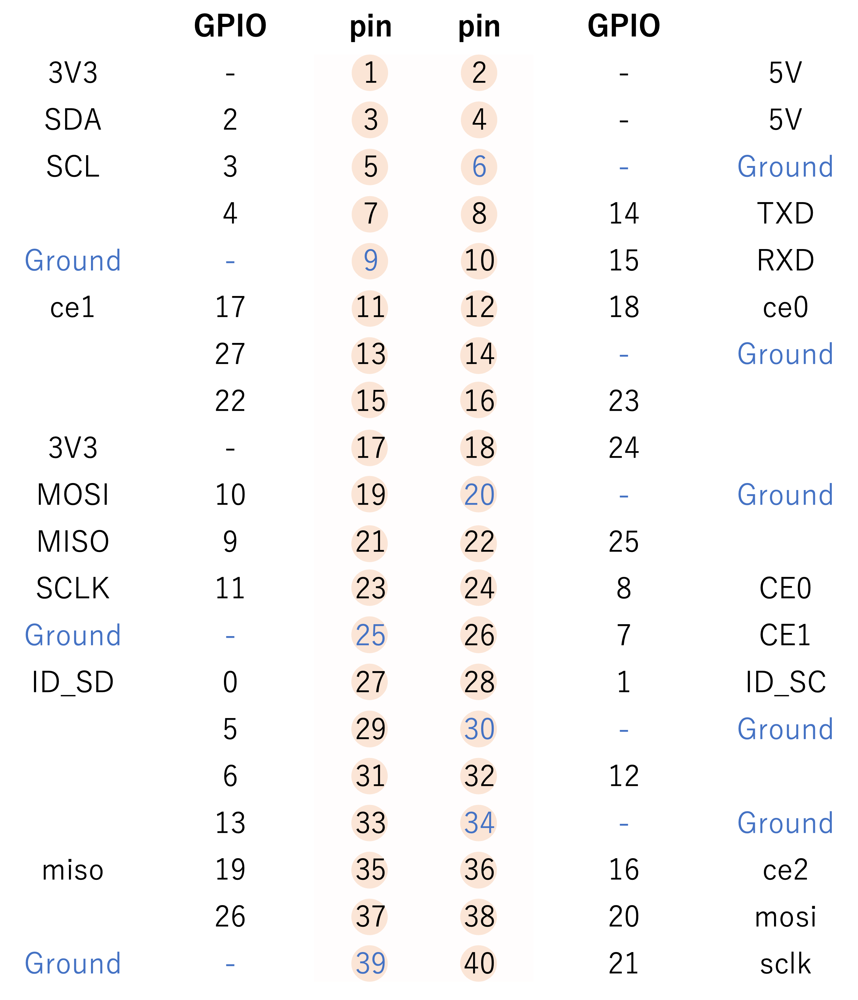

# 1. WiringPiを利用する場合
RaspberryPi用のGPIOインタフェースライブラリで、ライセンスはGNU LGPLv3のフリーソフトウェアです。デジタル入出力、シリアル通信、I2C、PWM、時間待ちなどの関数があります。

まずは、以下のコマンドでWiringPiがインストールされているかを確認します。
```
user@raspberrypi : ~$ gpio -v
```
これでversion情報が返ってくればOKですがそうでない場合は以下のようにしてinstallします。
```
user@raspberrypi : ~$ sudo apt-get update
user@raspberrypi : ~$ git clone https://github.com/WiringPi/WiringPi 
```
クローンが終了したら
```
user@raspberrypi : ~$ cd WiringPi
user@raspberrypi : ~$ ./build
```
として
```
All Done.

NOTE: To compile programs with wiringPi, you need to add:
    -lwiringPi
  to your compile line(s) To use the Gertboard, MaxDetect, etc.
  code (the devLib), you need to also add:
    -lwiringPiDev
  to your compile line(s).

```
というメッセージが表示されれば完了です。


<br>

# 2. pigpioを利用する場合
今回遊ぶ上で参考にしたテキストではGPIOを操作するコマンドとして`WiringPi`というライブラリのものを使用しています。しかし、これは2019年に開発元が開発停止を表明していたようで今後は非推奨のようです(参考にしたページに貼ってあるURLにとんでもページは見つかりませんが)。
そこで今回はいくつかるGPIO操作ライブラリのうち`pigpio`についてもかんたんにまとめておきました。[公式ページ](https://abyz.me.uk/rpi/pigpio/)にはライブラリの説明が次のように書いてあります。
>pigpioはラズベリーパイで使用可能なライブラリでGPIOのコントロールを行うことができます。ラズパイの全versionで動作します。

# 3. pigpioのインストール
このライブラリを使用するとシェルからGPIOを叩いたりPythonやCからGPIOを操作できるようです。

aptコマンドでインストールできます。
```shell
sudo apt install pigio
```
また、このライブラリを使用してGPIOにアクセスするためにはpigpiodというものを起動する必要があるようなのでそのために以下のコマンドを実行します。
```shell
sudo pigpiod
```

# 4. 使い方
pigpio.hライブラリを忘れずにincludeし、はじめに`gpioInitialise()`で初期化を行い、最後に`gpioTerminate()`で終了する。この2つの関数の間で様々な処理を行う。
```C
#include <pigpio.h>

int main(void)
{
    gpioInitialise(); //ライブラリの初期化

    //何らかの処理を行う

    gpioTerminate(); //ライブラリ使用の終了
}
```
コンパイル、実行は以下のように行う。
```
gcc -Wall -pthread -o program main.c -lpigpio -lrt

./program
```
このライブラリを使用するにあたっては次の注意点がある。

#### 実行時にpigpioを起動してはならない
例えばPythonでこのライブラリを使用している記事を参考にすると
```
sudo pigpiod
```
としてデーモンなるものを起動させていたが、Cで直接ライブラリをリンクしている場合は上記の操作を行うとエラーが出るようである。したがって、もし起動させている場合は
```
sudo killall pigpiod
```
でデーモンを終了してからファイルを実行する必要がある。

# 5. PIN番号とGPIO番号の対応(4Bの場合)
ラズパイのGPIO番号はどのモデルを使用しているかによって微妙に異なるようである。pigpioの公式ページでは4BはType 3にカテゴライズされているようで、対応は以下のようになっているようである。
- ピンは全部で40ある
- ハードウェアのリビジョン番号が16以上であること。
- ユーザーGPIOは2-27までである。(0と1は予約済み)



# 6. pigpio (C interface)の一部関数の紹介
[公式ページ](http://abyz.me.uk/rpi/pigpio/cif.html#gpioInitialise)を参考にしながら最低限必要そうなものをまとめた。必要に応じて随時付け足していく。
1. SetUp関連

    |関数     |  説明|
    |---------|---|
    |`int gpioInitialise()`&nbsp;&nbsp;&nbsp;&nbsp;&nbsp;| ライブラリの初期化を行う。正常に動作すればpigpioのversion番号を返す。pigpioライブラリを用いる場合、まずはじめにこの関数を呼び出さなければならない。|
    |`void Terminate()`|ライブラリを終了する。プログラムを終了する前に呼び出す。この関数は使用済みDMAチャンネルのリセット、メモリの開放、そして実行中のスレッドを終了させる。|

2. 使用頻度の高い関数

    |関数|説明|
    |--------|-----|
    |`int` <br> `gpioSetMode(unsigned gpio, unsigned mode)`|GPIO番号とモードを設定する。典型例でいうとinputかoutputかを指定する。<br>※注1参照|
    |`int gpioGetMode(unsigned gpio)`|GPIO番号を取得する。|
    |`int` <br>`gpioSetPullUpDown(unsigned gpio, unsigned pud)`|GPIO番号を指定し、oudにPUD_UP(プルアップ抵抗付き)、PUD_DOWN(プルダウン抵抗付き)、PUD_OFF(抵抗なし)の中から選択する。<br>※注2参照|
    |`int gpioRead(unsigned gpio)`|GPIO番号を指定し、入力された信号がonかoffかを返す。|
    |`int` <br>`gpioWrite(unsigned gpio, unsigned level)`|GPIO番号を指定し、onまたはoff(0 or 1)を選択する。|

    注1
    ```
    gpio : 0 - 53  (GPIO番号のこと)
    mode : 0 - 7   (GPIOピンはAlternate function(代替機能)を選択して、ピンに割り当てる機能を変更することができる。詳細は公式でドキュメントのp102)
    ```
    使用例は以下のとおりである。
    ```C
    gpioSetMode(17, PI_INPUT);  //GPIO17を入力としてセットする
    gpioSetMode(18, PI_OUTPUT); //GPIO18を出力としてセットする
    gpioSetMode(22, PI_ALT0);   //GPIO22を代替機能0としてセットする
    ```
    注2
    ```C
    gpioSetPullUpDown(17, PI_PUD_UP);   //Sets a pull-up
    gpioSetPullUpDown(18, PI_PUD_DOWN); //Sets a pu;;-down
    gpioSetPullUpDown(23, PI_PUD_OFF);  //Clear any pull-ups/down
    ```
3. PWM関連
    |関数|説明|
    |--------|-----|
    |`int`<br> `gpioPWM(unsigned user_gpio, unsigned dutycycle)`|GPIOでPWMを扱う。dutycycleは0(off)からrange(full on)の範囲である。デフォルトではrange = 255になっている<br>注3参照|

    
    注3
    ```
    user_gpio : 0-31
    dutycycle : 0-range
    ```
    使用例
    ```C
    gpioPWM(17,255); //Sets GPIO17 full on
    gpioPWM(18,128); //Sets GPIO17 half on
    gpioPWM(23,0);   //Sets GPIO23 full off
    ```

4. Timing関連
    |関数|説明|
    |--------|-----|
    |`uint32_t`<br> `gpioDelay(uint32_t micros)`|ms単位の待ち時間を設定する。実際の遅延時間を返す。|
    |`int`<br> `gpioTime(unsigned timetype, int *seconds, int *micros)`|変数secondsとmicrosを現在の時刻で更新する<br>注4参照|
    |`int`<br>`gpioSleep(unsigned timetype, int seconds, int micros)`|指定した秒数だけスリープさせる。正常に動作すれば０を返す。50マイクロsecまたはそれより短い時間の場合は`gpioDelay`を使用するのが良い。<br>注5参照|
    |`void`<br> `time_sleep(double seconds)`|指定された秒数だけ実行を遅延させる|

    注4
    ```
    tymetype : 0 (relative), 1(absolute)
    seconds  : a pointer to an int to hold seconds
    micros   : a pointer to an int to hold microseconds
    ```
    pigpioライブラリを初期化してからの開始してからの時間は以下のようにして知ることができる
    ```C
    int sec, mics
    gpioTime(PI_TIME_RELATIVE, &secs, &mics);
    print("library started %d.%03d seconds ago", secs, mics/1000);
    ```

    注5
    ```
    tymetype : 0 (relative), 1(absolute)
    seconds  : seconds to sleep
    micros   : microseconds to sleep
    ```
    使用例
    ```
    gpioSleep(PI_TIME_RELATIVE, 2, 500000); //2.5秒スリープさせる
    gpioSleep(PI_TIME_RELATIVE, 0, 100000); //0.1秒スリープさせる
    gpioSleep(PI_TIME_RELATIVE, 60, 0);     //1分スリープさせる
    ```


# 6. 補足事項
- `プルアップ、プルダウン`
    ...とりあえずは次のサイトを参照のこと([プルアップ抵抗・プルダウン抵抗とは？](https://voltechno.com/blog/pullup-pulldown/))。 あとで時間を見つけて自分の言葉で説明をかくことにします。
- `PWM = Pulse Width Modulation`
    ...パルス幅変調と呼ばれ、パルス波形のON/OHHの比率(=デューティー比)を変化させて信号を変調させる。LEDにPWMを使うことでLEDの点滅、調光が簡単に扱える様になる。ラズパイには2チャンネル(PWM0とPWM1)のハードウェアPWM回路がある。それぞれのチャンネルは2つのGPIOが接続しており、出力先を選択できる。1つのチャンネルから(2つのGPIO)からPWM信号を出力させられるが同一のPWM信号になる。
